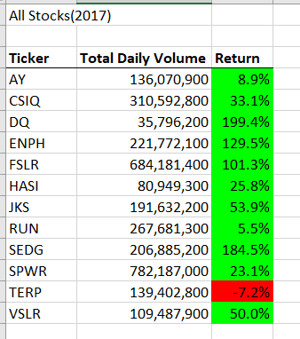
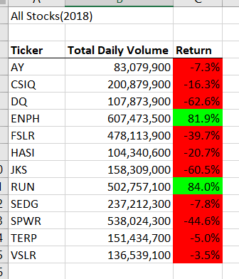
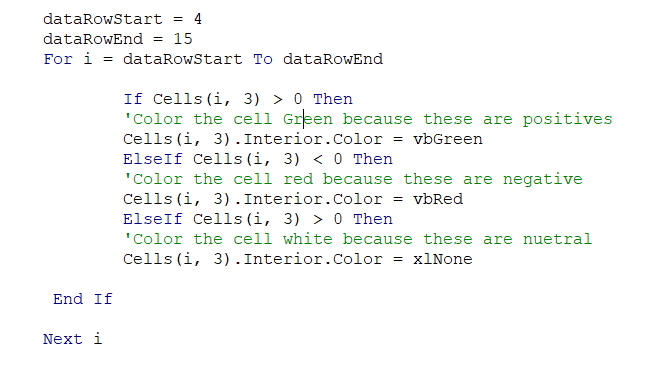
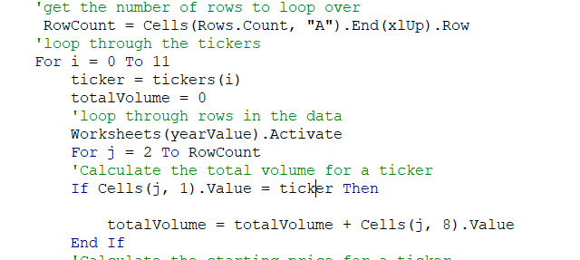
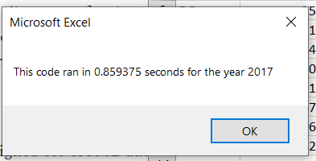
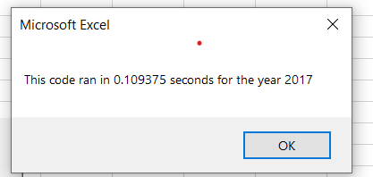
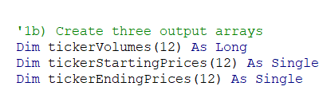
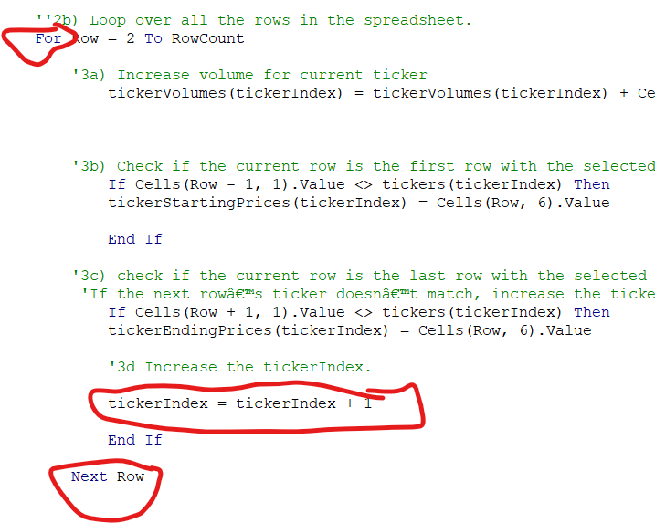

# Module 2 - Written Summary
## Project Overiew
This project involved Microsoft Visual Basic, a coding language used to communicate with microsoft products. With VBA we were able to create macros in our excel spreadsheet that allowed us to analyze the data quicker than manual entries would have been able to do. For this particular project we created macros that allowed us to sift through 2 years worth of stock data (over 6000 columns) for over 12 different stock indexes in order to give the best stock advice to our clients, in this case the parents of our stakeholder. We did this by showing the Return for a stock, and if that stock were green (as formatted in excel) it would have been a solid choice. If red, then we would stray away from that stock index.
  
## Results
### Initial Analysis
According to our analysis of the stock indexes, in 2017 all but 1 stock performed well. TERP had a negative return of -7.2% with a total volume traded of 139,402,800.

In 2018, there were only 2 stocks that performed well.ENPH with a return of 81.9% and a volume of 607,473,500 and RUN with a return of 84.0% and a total volume of 502,757,100.
The postive returns are seen in green and the negative returns are seen in red for both screenshots below.
  

The code that was used to create the formatting can be seen below. As we see from the code screenshot 2, we use a for loop to iterate through our 12 tickers and with a for loop, we color code our returns to show to the clients the positive and negative returns.

Another notable difference from 2017 to 2018 is the amount of total volume that was traded. In 2018 more volume was traded with 7 of the 12 stocks, but that did not necessarily result in a better return. To calculate the total volume we used the code below. 

A for loop was needed to iterate through each stock, as well as an inner for loop to iterate trhough every row for a specific ticker. It was VERY important that the total volume was set to 0 because that reset the value from the previous stock to 0 so there was no overlap in volume. 

### Timer Results (Pre-Refactor)
Below we can see the endtime for our "All Stocks Analysis" macro for both years.

### Timer Results (Post-Refactor)
Below we can see the results of our "All Stocks Analysis Refactored" macro running for both 2017 and 2018. 

As we can see this is faster than our previous timers, due to the arrays we used in our refactored code seen below(output arrays). Through these arrays we were able to store the values of our starting price, ending price and total volume in those arrays rather than calculating each one after the row and adding that value to the total.

 We also created code to iterate through each ticker (Ticker Index Calculation) rather than each row, we esentially automated the movement of the tickers with the code refactor.

##  Summary
### Advantages of Refactoring
There are several that come to mind when I look at refactoring. It allows for us to take a look back at our code and attempt to improve that code. It also makes us rethink, which should always be done in coding. You also may improve the effeciency of the code, and improve the runtimes, that will ultimately save time for a client. 
### Disadvantages of Refactoring
The one thing that comes to mind when I look at refactoring is time consuming. Depending on how long it has been since the initial code was created, or by whom the code was created, a portion of the refactoring may be researching or reverse engineering the initial code.At times the time commitment to refactor may not be worth the result. If you spent hours refactoring a code that the result will not have true value then it may be a waste of time.

### How do these pros and cons apply to refactor script?
In this scenario we were able to improve our code efficiency by a matter of milliseconds for our client, but with this new code the client will be able to analyze more than just 12 stock indexes. The true value is how fast it can iterate through each ticker. Also the amount of research beforehand that was needed to identify the meaning of the code was not needed because 1. I wrote the code, and 2. The refactor was done in a small timeframe.

